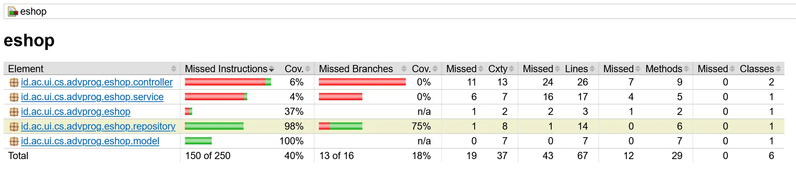
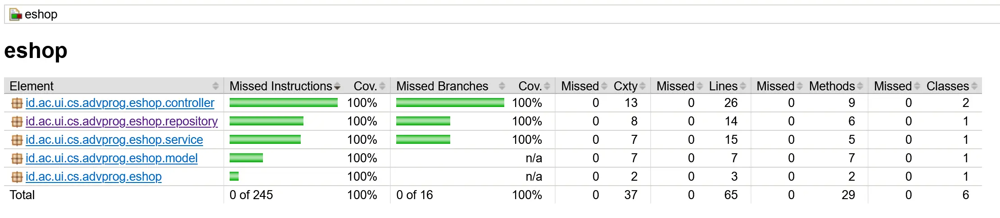
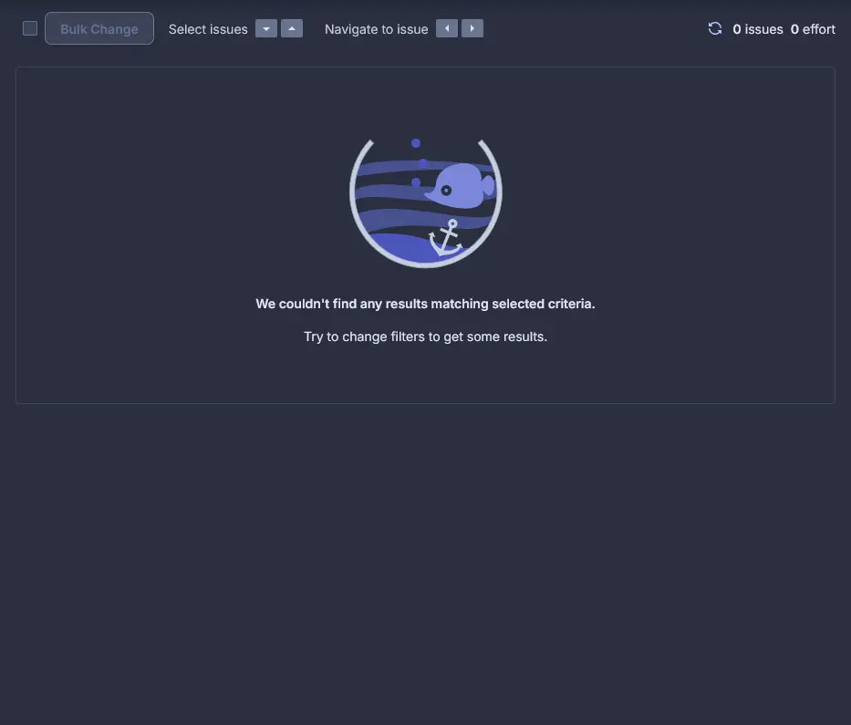
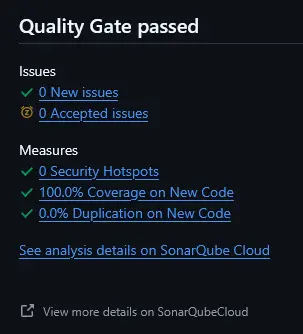

# E-Shop (Adv. Programming Project)

## Deployed Application URL

#### Product List Page  
[https://musical-jennine-absolutepraya-ccf87b13.koyeb.app/product/list](https://musical-jennine-absolutepraya-ccf87b13.koyeb.app/product/list)

#### Car List Page
[https://musical-jennine-absolutepraya-ccf87b13.koyeb.app/car/list](https://musical-jennine-absolutepraya-ccf87b13.koyeb.app/car/list)

## Contents

1. **WEEK 1**
   - [Reflection 1](#reflection-1-week-1)
   - [Reflection 2](#reflection-2-week-1)
2. **WEEK 2**
   - [Reflection](#reflection-week-2)
3. **WEEK 3**
   - [Reflection](#reflection-week-3)

## Reflection 1 Week 1

Understanding how list-product (basically GET all products) works is relatively easy. The code from the tutorial is straightforward and easy to understand.

Next, we are asked to implement edit and delete product feature on our own. Implementing both features were not that difficult. The code from the tutorial was a good reference to start with.

### Edit Product & Delete Product Feature

**Note**:
I added UUID to the product class so each product has a unique identifier.

1. For each method, I started with editing the `ProductService.java` and `ProductServiceImpl.java`, I added the new method `editProduct` which takes a product object as parameter.
2. Then, I add both methods to `ProductRepository.java` so that the methods can be used in the controller.
3. Next, I added the edit product mapping to `ProductController.java`, which makes 2 calls to the service layer, one to get the page and another to save the updated product.
4. Finally, I created a new HTML file `EditProduct.html` and added the form to edit the product.
5. I basically repeated the same steps for the delete product feature.

### Clean Code

Clean code practices were followed. I tried to keep the code clean and readable:

1. Single Responsibility Principle: Each class has a single purpose.
   - ProductController handles routing and request handling
   - ProductService handles business logic
   - ProductRepository handles data persistence
2. Code is self-explanatory and easy to understand.
3. Clear method names:

   ```java
       @GetMapping("/create")
       public String createProductPage(Model model) {
           Product product = new Product();
           model.addAttribute("product", product);
           return "createProduct";
       }

       @PostMapping("/create")
       public String createProductPost(@ModelAttribute Product product, Model model) {
           service.create(product);
           return "redirect:list";
       }
   ```

4. Code is well-documented.

### Secure Coding Practices

1. Input Validation: Forms include required field validation.

   ```html
   <input
   	th:field="*{productName}"
   	type="text"
   	class="form-control mb-4 col-4"
   	id="nameInput"
   	placeholder="Enter product's name"
   	required
   />
   ```

2. Safe Navigation: Using proper redirects after operations.
   ```java
   @GetMapping("/delete")
   public String deleteProduct(@RequestParam String id) {
       service.delete(id);
       return "redirect:list";
   }
   ```

### Challenges & Mistakes

I initially had some trouble with the directory structure. With the package name being `id.ac.ui.cs.advprog.eshop`, there were some redundant directories. I thought it was a mistake that only occurred on my machine, so I changed the structure to only using 1 subdirectory, which was `/id.ac.ui.cs.advprog.eshop` instead of `/id/ac/ui/cs/advprog/eshop`. But after going further into the tutorial, I realized it may be intended to be that way.

### Conclusion

Afterall, for me, Spring Boot is like a combination of a Django and Express.js. It is easy to understand, but maybe it's not the most straightforward framework to start with. I think it's a good framework to learn after you have some experience with other frameworks.

## Reflection 2 Week 1

### Testing and Coverage

After writing unit tests for the Product features, I learned several important lessons about testing:

1.  Number of Unit Tests

    - There's no fixed number of unit tests that should be made in a class
    - The number depends on the complexity of the class and its methods
    - Looking at `ProductRepositoryTest.java`, we can see multiple test cases for each functionality.
    - Tests cover normal cases, edge cases, and error cases

2.  Test Coverage
    Code coverage helps measure how much code is executed by tests
    My tests achieve good coverage by testing:

    - Basic CRUD operations
    - Empty/null cases
    - Multiple items scenarios
    - Non-existent items

    However, 100% code coverage doesn't guarantee bug-free code because:

    - Tests might not cover all possible input combinations
    - Logic errors can exist even with full coverage
    - Some edge cases might be missed
    - Integration issues might not be caught

3.  Verification
    To ensure adequate testing, we should:

    - Test both positive and negative scenarios
    - Cover edge cases and boundary conditions

### Code Cleanliness in Functional Tests

The new functional test suite for verifying product list items raises several clean code concerns:

1. Code Duplication:

   - Setup code is duplicated across test classes:

     ```java

     @LocalServerPort
     private int serverPort;

     @Value("${app.baseUrl:http://localhost}")
     private String testBaseUrl;

     private String baseUrl;

     @BeforeEach
     void setupTest() {
         baseUrl = String.format("%s:%d", testBaseUrl, serverPort);
     }
     ```

   - Similar initialization of WebDriver and base URL

2. Maintainability Issues

   - Hardcoded URLs in test cases
   - Changing the base URL requires updating all test cases
   - Test structure is not standardized across files

### Improving Functional Tests

1. Create a Base Test Class, for example:

   ```java
   @SpringBootTest(webEnvironment = RANDOM_PORT)
   @ExtendWith(SeleniumJupiter.class)
   public abstract class BaseFunctionalTest {
       @LocalServerPort
       protected int serverPort;

       @Value("${app.baseUrl:http://localhost}")
       protected String testBaseUrl;

       protected String baseUrl;

       @BeforeEach
       void setupBaseTest() {
           baseUrl = String.format("%s:%d", testBaseUrl, serverPort);
       }

       protected void navigateToPage(ChromeDriver driver, String path) {
           driver.get(baseUrl + path);
       }
   }
   ```

2. Create Test Utilities Class, for example:

   ```java
   public class TestUtils {
       public static void verifyProductInList(ChromeDriver driver, String productName, int quantity) {
           WebElement productTable = driver.findElement(By.cssSelector("table"));
           String tableContent = productTable.getText();
           assertTrue(tableContent.contains(productName));
           assertTrue(tableContent.contains(String.valueOf(quantity)));
       }
   }
   ```

3. Refactor Test Classes to Use Base Class, for example:

   ```java
   class ProductListFunctionalTest extends BaseFunctionalTest {
       @Test
       void verifyProductCount(ChromeDriver driver) {
           navigateToPage(driver, "/product/list");
           // Test specific logic here
       }
   }
   ```

## Reflection Week 2

### Code Quality Issues and Fixed

After installing Jacoco and opening the report HTML, this is the result:



Initially, this project only has **40%** of code instructions coverage and **18%** of branch coverage. I tried to increase the coverage by writing more tests and fixing the existing ones across these files:

- `HomeControllerTest.java`
- `ProductControllerTest.java`
- `ProductRepositoryTest.java`
- `ProductServiceImplTest.java`

After fixing the tests, the coverage increased to **100%** for both code instructions and branches. This is the result:



Then, I installed SonarCloud to analyze the code quality. The result is:


As you can see, there are 15 issues which need to be fixed. I fixed the issues by following the suggestions from SonarCloud. These includes changes in the following files:

- `ProductController.java`
  - Defined a constant instead of duplicating this literal "redirect:list" 4 times.
- `EshopApplicationTests.java`
  - Added at least 1 test case to testMain() method.
  - Added a nested comment explaining why a method is empty.
- `ProductControllerTest.java`
  - Removed unused imports.
- `CreateProductFunctionalTest.java`
  - Removed the declaration of thrown exception 'java.lang.Exception', as it cannot be thrown from method's body.
- `HomePageFunctionalTest.java`
  - Removed the declaration of thrown exception 'java.lang.Exception', as it cannot be thrown from method's body.
- `ProductRepositoryTest.java`
  - Added a nested comment explaining why a method is empty.
- `ProductServiceImplTest.java`
  - Removed unused imports.

After fixing the issues, the code quality improved significantly. The result is:





The project now has 0 issues.

### CI/CD Implementation Analysis

During tutorial and exercise, I successfully implemented several CI/CD automation using GitHub Actions. The CI/CD workflows are defined in `.github/workflows` directory. These include:

- **Continuous Integration (ci.yml)**

  - Automatically triggers on every push and pull request
  - Runs unit tests using Gradle
  - Ensures code builds correctly on Ubuntu 22.04 with Java 21
  - Maintains build consistency through Gradle caching

- **Code Quality Analysis (sonarcloud.yml)**

  - Performs automated code analysis on all branches
  - Generates and uploads code coverage reports using JaCoCo
  - Integrates with SonarCloud for detailed code quality metrics
  - Caches SonarCloud packages to improve workflow efficiency

- **Supply Chain Security (scorecard.yml)**

  - Runs security analysis using OSSF Scorecard
  - Scheduled weekly checks for maintenance status
  - Monitors branch protection rules
  - Publishes security results to GitHub's code scanning dashboard

- **Continuous Deployment**
  - Successfully deployed the application to Koyeb PaaS
  - Application is live and accessible at [E-Shop Application](https://musical-jennine-absolutepraya-ccf87b13.koyeb.app/product/list)
  - Enables real-world testing and validation of features

The current implementation effectively meets the definition of Continuous Integration and Continuous Deployment for several reasons:

1. **Automated Testing & Integration**: Every code change triggers automatic builds and tests through the CI workflow, ensuring that new code integrates properly with the existing codebase. The comprehensive test suite, achieving 100% coverage, validates both functionality and integration.

2. **Code Quality Gates**: The integration with SonarCloud provides automated quality checks, ensuring that only code meeting quality standards proceeds further. This includes checks for code smells, vulnerabilities, and maintainability issues, creating a robust quality assurance process.

3. **Security Monitoring**: The Scorecard workflow adds an additional layer of security analysis, particularly focusing on supply chain security. This proactive security approach helps identify and prevent potential vulnerabilities before they reach production.

4. **Continuous Feedback**: Developers receive immediate feedback on their changes through test results, code quality metrics, and security analysis. This rapid feedback loop allows for quick identification and resolution of issues, maintaining high code quality standards.

5. **Production Deployment**: The application is successfully deployed to a production environment using Koyeb PaaS, completing the CI/CD pipeline by providing a live, accessible version of the application. This demonstrates the full cycle from development through to production deployment.

## Reflection Week 3

### 1) Principles Applied to the Project

#### a. Single Responsibility Principle (SRP)

**Yes, SRP has been implemented.**

The Single Responsibility Principle states that a class should have only one reason to change, meaning it should have only one responsibility. In our project:

- **Models** (Product, Car) are responsible only for data representation
- **Repositories** (ProductRepository, CarRepository) handle only data persistence operations
- **Services** (ProductService, CarService) contain only business logic
- **Controllers** (ProductController, CarController) are solely responsible for handling HTTP requests
- **Utility Services** like IdGeneratorService have a single focused responsibility

For example, our ProductController only handles routing and request handling:

```java
@Controller
@RequestMapping("/product")
public class ProductController extends AbstractItemController<Product> {
    // Only handles HTTP requests, delegates business logic to services
}
```

While the ProductServiceImpl focuses only on business logic:

```java
@Service
public class ProductServiceImpl extends AbstractItemService<Product, ItemRepository<Product>> implements ProductService {
    // Only contains business logic, delegates persistence to repositories
}
```

And the ProductRepository deals only with data operations:

```java
public class ProductRepository extends AbstractItemRepository<Product> {
    // Only handles CRUD operations for products
}
```

#### b. Open/Closed Principle (OCP)

**Yes, OCP has been implemented.**

The Open/Closed Principle states that software entities should be open for extension but closed for modification. Our project demonstrates this through:

- **Abstract Base Classes** that can be extended without modifying existing code
- **Interfaces** that define contracts which can be implemented in multiple ways
- **Inheritance Hierarchies** that allow new functionality to be added through extension

For example, our AbstractItemRepository provides a base implementation that can be extended:

```java
public abstract class AbstractItemRepository<T extends Identifiable> implements ItemRepository<T> {
    // Common implementation for all repositories

    @Override
    public abstract T update(T item); // Forces subclasses to implement specific update logic
}
```

We can add new types of items (like Books or Electronics) without modifying existing code by:

1. Creating a new model extending AbstractItem
2. Creating a new repository extending AbstractItemRepository
3. Creating a new service extending AbstractItemService
4. Creating a new controller extending AbstractItemController

#### c. Liskov Substitution Principle (LSP)

**Yes, LSP has been implemented.**

The Liskov Substitution Principle states that objects of a superclass should be replaceable with objects of a subclass without affecting the correctness of the program. In our project:

- Subclasses like Product and Car extend AbstractItem without breaking its behavior
- AbstractItemService and AbstractItemRepository define contracts that are correctly implemented by their subclasses
- The service layer can work with any Item implementation without knowing its concrete type

For example, our inheritance hierarchy ensures that:

```java
// This generic method can work with any Item subclass
public abstract class AbstractItemService<T extends Identifiable, R extends ItemRepository<T>> implements ItemService<T> {
    @Override
    public List<T> findAll() {
        Iterator<T> itemIterator = repository.findAll();
        List<T> allItems = new ArrayList<>();
        itemIterator.forEachRemaining(allItems::add);
        return allItems;
    }
}
```

The ProductService.java interface explicitly avoids legacy methods that would violate LSP:

```java
public interface ProductService extends ItemService<Product> {
    // No need for legacy methods as they violate LSP
}
```

#### d. Interface Segregation Principle (ISP)

**Yes, ISP has been implemented.**

The Interface Segregation Principle states that clients should not be forced to depend on interfaces they do not use. Our project demonstrates this through:

- **Small, focused interfaces** (Identifiable, Named, Quantifiable, Colorable)
- **Composed interfaces** that combine smaller interfaces for specific needs
- **Interface hierarchies** that allow clients to depend only on what they need

For example, instead of having one large Item interface with all possible methods, we've segregated them:

```java
public interface Identifiable {
    String getId();
    void setId(String id);
}

public interface Named {
    String getName();
    void setName(String name);
}

public interface Quantifiable {
    int getQuantity();
    void setQuantity(int quantity);
}

public interface Colorable {
    String getColor();
    void setColor(String color);
}
```

Then we compose these interfaces as needed:

```java
public interface Item extends Identifiable, Named, Quantifiable {
    // No additional methods needed as we're composing from other interfaces
}

public interface CarItem extends Item, Colorable {
    // Car-specific interface that includes color functionality
}
```

This way, clients only need to depend on the interfaces they actually use.

#### e. Dependency Inversion Principle (DIP)

**Yes, DIP has been implemented.**

The Dependency Inversion Principle states that high-level modules should not depend on low-level modules; both should depend on abstractions. Our project demonstrates this through:

- **Dependency injection** throughout the codebase
- **Configuration classes** that wire components together
- **Interfaces** that abstract away implementation details

For example, services depend on repository interfaces, not concrete implementations:

```java
public abstract class AbstractItemService<T extends Identifiable, R extends ItemRepository<T>> implements ItemService<T> {
    @Autowired
    protected R repository; // Depends on the repository interface, not implementation
}
```

And our configuration classes handle the wiring:

```java
@Configuration
public class RepositoryConfig {
    @Bean
    public ItemRepository<Product> productRepositoryBean(IdGeneratorService idGeneratorService) {
        return new ProductRepository(idGeneratorService);
    }
}
```

This allows us to easily swap implementations (like switching to a different database) without changing the business logic.

### 2) Advantages of Applying SOLID Principles

#### Maintainability

- **SRP makes code easier to understand and maintain** - Each class has a clear responsibility, making it easier to locate and fix issues. For example, if we need to change how products are stored, we only need to modify ProductRepository.
- **OCP reduces the risk of breaking existing functionality** - When adding a new item type like Books, we don't need to modify existing code, just extend it.

#### Flexibility and Extensibility

- **ISP enables targeted interface implementations** - We can implement only the interfaces we need. For example, only car items need to implement Colorable.
- **LSP allows polymorphic behavior** - Our services can work with any Item implementation because they adhere to a consistent contract.

#### Testability

- **DIP makes testing easier through dependency injection** - We can easily mock dependencies in tests. For example, in ProductServiceImplTest, we can mock the repository:

```java
@Mock
private ItemRepository<Product> productRepository;

@Test
void create_shouldCreateProduct() {
    when(productRepository.create(any(Product.class))).thenReturn(product);
    Product created = productService.create(product);
    verify(productRepository, times(1)).create(product);
}
```

#### Code Reuse

- **Abstract base classes reduce duplication** - AbstractItemController, AbstractItemService, and AbstractItemRepository provide reusable functionality that specific implementations inherit.

### 3) Disadvantages of Not Applying SOLID Principles

#### Code Duplication

Without SRP and OCP, we would likely have duplicate code across controllers and services. For example, without AbstractItemController, each controller would need to reimplement CRUD operations:

```java
// Duplicate code in every controller without proper abstraction
@GetMapping("/list")
public String productListPage(Model model) {
    model.addAttribute("products", productService.findAll());
    return "productList";
}

@GetMapping("/list")
public String carListPage(Model model) {
    model.addAttribute("cars", carService.findAll());
    return "carList";
}
```

#### Tight Coupling

Without DIP, high-level modules would depend directly on low-level modules:

```java
// Tight coupling without DIP
public class ProductServiceImpl {
    // Direct dependency on concrete implementation instead of interface
    private ProductRepository repository = new ProductRepository();

    // Hard to test, hard to change implementations
}
```

#### Rigidity

Without OCP, adding new features would require modifying existing code:

```java
// Without OCP, we'd need to modify this class to add a new item type
public class ItemService {
    public Item createItem(String type, Map<String, Object> properties) {
        if (type.equals("product")) {
            return createProduct(properties);
        } else if (type.equals("car")) {
            return createCar(properties);
        } else if (type.equals("book")) { // Adding a new type requires modifying existing code
            return createBook(properties);
        }
        return null;
    }
}
```

#### Bloated Interfaces

Without ISP, clients would need to implement methods they don't use:

```java
// Without ISP - one large interface forcing unnecessary implementations
public interface LargeItemInterface {
    // All items must implement these, even if not needed
    String getId();
    void setId(String id);
    String getName();
    void setName(String name);
    int getQuantity();
    void setQuantity(int quantity);
    String getColor(); // Only relevant for cars
    void setColor(String color); // Only relevant for cars
    String getAuthor(); // Only relevant for books
    void setAuthor(String author); // Only relevant for books
}
```

#### Brittle Inheritance

Without LSP, inheritance hierarchies become fragile and prone to errors:

```java
// Without LSP - subtypes might break expected behavior
class Rectangle {
    protected int width;
    protected int height;

    public void setWidth(int width) { this.width = width; }
    public void setHeight(int height) { this.height = height; }
    public int getArea() { return width * height; }
}

// Violates LSP
class Square extends Rectangle {
    // Square changes both width and height, breaking the expected behavior
    @Override
    public void setWidth(int width) {
        this.width = width;
        this.height = width; // Breaking the expected behavior of Rectangle
    }

    @Override
    public void setHeight(int height) {
        this.height = height;
        this.width = height; // Breaking the expected behavior of Rectangle
    }
}
```

By contrast, our project's adherence to SOLID principles has resulted in a codebase that is more maintainable, flexible, testable, and reusable.
