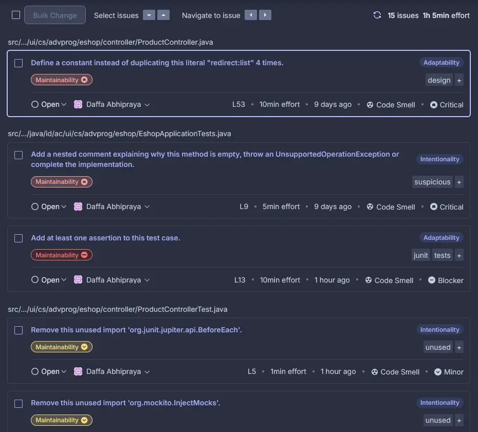

# E-Shop (Adv. Programming Project)

## Contents

1. **WEEK 1**
   - [Reflection 1](#reflection-1-week-1)
   - [Reflection 2](#reflection-2-week-1)
2. **WEEK 2**
   - [Reflection](#reflection-week-2)

## Reflection 1 Week 1

Understanding how list-product (basically GET all products) works is relatively easy. The code from the tutorial is straightforward and easy to understand.

Next, we are asked to implement edit and delete product feature on our own. Implementing both features were not that difficult. The code from the tutorial was a good reference to start with.

### Edit Product & Delete Product Feature

**Note**:
I added UUID to the product class so each product has a unique identifier.

1. For each method, I started with editing the `ProductService.java` and `ProductServiceImpl.java`, I added the new method `editProduct` which takes a product object as parameter.
2. Then, I add both methods to `ProductRepository.java` so that the methods can be used in the controller.
3. Next, I added the edit product mapping to `ProductController.java`, which makes 2 calls to the service layer, one to get the page and another to save the updated product.
4. Finally, I created a new HTML file `EditProduct.html` and added the form to edit the product.
5. I basically repeated the same steps for the delete product feature.

### Clean Code

Clean code practices were followed. I tried to keep the code clean and readable:

1. Single Responsibility Principle: Each class has a single purpose.
   - ProductController handles routing and request handling
   - ProductService handles business logic
   - ProductRepository handles data persistence
2. Code is self-explanatory and easy to understand.
3. Clear method names:

   ```java
       @GetMapping("/create")
       public String createProductPage(Model model) {
           Product product = new Product();
           model.addAttribute("product", product);
           return "createProduct";
       }

       @PostMapping("/create")
       public String createProductPost(@ModelAttribute Product product, Model model) {
           service.create(product);
           return "redirect:list";
       }
   ```

4. Code is well-documented.

### Secure Coding Practices

1. Input Validation: Forms include required field validation.

   ```html
   <input
   	th:field="*{productName}"
   	type="text"
   	class="form-control mb-4 col-4"
   	id="nameInput"
   	placeholder="Enter product's name"
   	required
   />
   ```

2. Safe Navigation: Using proper redirects after operations.
   ```java
   @GetMapping("/delete")
   public String deleteProduct(@RequestParam String id) {
       service.delete(id);
       return "redirect:list";
   }
   ```

### Challenges & Mistakes

I initially had some trouble with the directory structure. With the package name being `id.ac.ui.cs.advprog.eshop`, there were some redundant directories. I thought it was a mistake that only occurred on my machine, so I changed the structure to only using 1 subdirectory, which was `/id.ac.ui.cs.advprog.eshop` instead of `/id/ac/ui/cs/advprog/eshop`. But after going further into the tutorial, I realized it may be intended to be that way.

### Conclusion

Afterall, for me, Spring Boot is like a combination of a Django and Express.js. It is easy to understand, but maybe it's not the most straightforward framework to start with. I think it's a good framework to learn after you have some experience with other frameworks.

## Reflection 2 Week 1

### Testing and Coverage

After writing unit tests for the Product features, I learned several important lessons about testing:

1.  Number of Unit Tests

    - There's no fixed number of unit tests that should be made in a class
    - The number depends on the complexity of the class and its methods
    - Looking at `ProductRepositoryTest.java`, we can see multiple test cases for each functionality.
    - Tests cover normal cases, edge cases, and error cases

2.  Test Coverage
    Code coverage helps measure how much code is executed by tests
    My tests achieve good coverage by testing:

    - Basic CRUD operations
    - Empty/null cases
    - Multiple items scenarios
    - Non-existent items

    However, 100% code coverage doesn't guarantee bug-free code because:

    - Tests might not cover all possible input combinations
    - Logic errors can exist even with full coverage
    - Some edge cases might be missed
    - Integration issues might not be caught

3.  Verification
    To ensure adequate testing, we should:

    - Test both positive and negative scenarios
    - Cover edge cases and boundary conditions

### Code Cleanliness in Functional Tests

The new functional test suite for verifying product list items raises several clean code concerns:

1. Code Duplication:

   - Setup code is duplicated across test classes:

     ```java

     @LocalServerPort
     private int serverPort;

     @Value("${app.baseUrl:http://localhost}")
     private String testBaseUrl;

     private String baseUrl;

     @BeforeEach
     void setupTest() {
         baseUrl = String.format("%s:%d", testBaseUrl, serverPort);
     }
     ```

   - Similar initialization of WebDriver and base URL

2. Maintainability Issues

   - Hardcoded URLs in test cases
   - Changing the base URL requires updating all test cases
   - Test structure is not standardized across files

### Improving Functional Tests

1. Create a Base Test Class, for example:

   ```java
   @SpringBootTest(webEnvironment = RANDOM_PORT)
   @ExtendWith(SeleniumJupiter.class)
   public abstract class BaseFunctionalTest {
       @LocalServerPort
       protected int serverPort;

       @Value("${app.baseUrl:http://localhost}")
       protected String testBaseUrl;

       protected String baseUrl;

       @BeforeEach
       void setupBaseTest() {
           baseUrl = String.format("%s:%d", testBaseUrl, serverPort);
       }

       protected void navigateToPage(ChromeDriver driver, String path) {
           driver.get(baseUrl + path);
       }
   }
   ```

2. Create Test Utilities Class, for example:

   ```java
   public class TestUtils {
       public static void verifyProductInList(ChromeDriver driver, String productName, int quantity) {
           WebElement productTable = driver.findElement(By.cssSelector("table"));
           String tableContent = productTable.getText();
           assertTrue(tableContent.contains(productName));
           assertTrue(tableContent.contains(String.valueOf(quantity)));
       }
   }
   ```

3. Refactor Test Classes to Use Base Class, for example:

   ```java
   class ProductListFunctionalTest extends BaseFunctionalTest {
       @Test
       void verifyProductCount(ChromeDriver driver) {
           navigateToPage(driver, "/product/list");
           // Test specific logic here
       }
   }
   ```

## Reflection Week 2

### Code Quality Issues and Fixed

After installing Jacoco and opening the report HTML, this is the result:


Initially, this project only has **40%** of code instructions coverage and **18%** of branch coverage. I tried to increase the coverage by writing more tests and fixing the existing ones across these files:

- `HomeControllerTest.java`
- `ProductControllerTest.java`
- `ProductRepositoryTest.java`
- `ProductServiceImplTest.java`

After fixing the tests, the coverage increased to **100%** for both code instructions and branches. This is the result:


Then, I installed SonarCloud to analyze the code quality. The result is:



As you can see, there are 15 issues which need to be fixed. I fixed the issues by following the suggestions from SonarCloud. These includes changes in the following files:

- `ProductController.java`
  - Defined a constant instead of duplicating this literal "redirect:list" 4 times.
- `EshopApplicationTests.java`
  - Added at least 1 test case to testMain() method.
  - Added a nested comment explaining why a method is empty.
- `ProductControllerTest.java`
  - Removed unused imports.
- `CreateProductFunctionalTest.java`
  - Removed the declaration of thrown exception 'java.lang.Exception', as it cannot be thrown from method's body.
- `HomePageFunctionalTest.java`
  - Removed the declaration of thrown exception 'java.lang.Exception', as it cannot be thrown from method's body.
- `ProductRepositoryTest.java`
  - Added a nested comment explaining why a method is empty.
- `ProductServiceImplTest.java`
  - Removed unused imports.

After fixing the issues, the code quality improved significantly. The result is:


The project now has 0 issues.

### CI/CD Implementation Analysis

During tutorial and exercise, I successfully implemented several CI/CD automation using GitHub Actions. The CI/CD workflows are defined in `.github/workflows` directory. These include:

- **Continuous Integration (ci.yml)**
  - Automatically triggers on every push and pull request
  - Runs unit tests using Gradle
  - Ensures code builds correctly on Ubuntu 22.04 with Java 21
  - Maintains build consistency through Gradle caching

- **Code Quality Analysis (sonarcloud.yml)**
  - Performs automated code analysis on all branches
  - Generates and uploads code coverage reports using JaCoCo
  - Integrates with SonarCloud for detailed code quality metrics
  - Caches SonarCloud packages to improve workflow efficiency

- **Supply Chain Security (scorecard.yml)**
  - Runs security analysis using OSSF Scorecard
  - Scheduled weekly checks for maintenance status
  - Monitors branch protection rules
  - Publishes security results to GitHub's code scanning dashboard

- **Continuous Deployment**
  - Successfully deployed the application to Koyeb PaaS
  - Application is live and accessible at [E-Shop Application](https://musical-jennine-absolutepraya-ccf87b13.koyeb.app/product/list)
  - Enables real-world testing and validation of features

The current implementation effectively meets the definition of Continuous Integration and Continuous Deployment for several reasons:

1. **Automated Testing & Integration**: Every code change triggers automatic builds and tests through the CI workflow, ensuring that new code integrates properly with the existing codebase. The comprehensive test suite, achieving 100% coverage, validates both functionality and integration.

2. **Code Quality Gates**: The integration with SonarCloud provides automated quality checks, ensuring that only code meeting quality standards proceeds further. This includes checks for code smells, vulnerabilities, and maintainability issues, creating a robust quality assurance process.

3. **Security Monitoring**: The Scorecard workflow adds an additional layer of security analysis, particularly focusing on supply chain security. This proactive security approach helps identify and prevent potential vulnerabilities before they reach production.

4. **Continuous Feedback**: Developers receive immediate feedback on their changes through test results, code quality metrics, and security analysis. This rapid feedback loop allows for quick identification and resolution of issues, maintaining high code quality standards.

5. **Production Deployment**: The application is successfully deployed to a production environment using Koyeb PaaS, completing the CI/CD pipeline by providing a live, accessible version of the application. This demonstrates the full cycle from development through to production deployment.